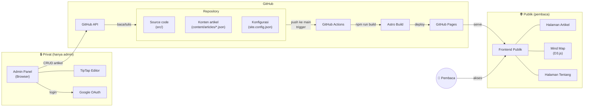
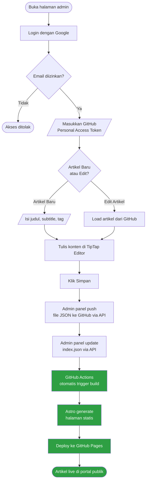

# Warta — Platform Blog Personal dengan Mind Map


Warta adalah platform blog personal yang menggabungkan penulisan artikel dengan visualisasi peta pikiran (mind map). Setiap artikel saling terhubung melalui tag dan relasi manual, membentuk jaringan ide yang bisa dieksplorasi secara visual.

**Live site:** [familianto.github.io/warta](https://familianto.github.io/warta)

## Screenshot

[Screenshot homepage]

[Screenshot mind map]

## Fitur Utama

- Blog dengan desain bersih ala Medium
- Visualisasi mind map hubungan antar artikel (D3.js)
- Admin panel dengan WYSIWYG editor (TipTap)
- Google OAuth untuk keamanan admin
- GitHub sebagai database (tanpa server, gratis total)
- Auto-deploy via GitHub Actions
- Dark mode otomatis
- SEO-friendly dengan Open Graph tags
- 100% gratis — GitHub Pages hosting
- Open source — fork dan gunakan sendiri

## Arsitektur & Alur Kerja

### Arsitektur Sistem



### Alur End-to-End (Login sampai Publish)



> **Catatan:** Langkah dari _GitHub Actions_ sampai _Artikel live_ (area hijau) terjadi otomatis, total sekitar 1-2 menit.

Diagram di atas juga dapat dilihat dan diedit di [mermaid.live](https://mermaid.live) — cukup copy kode Mermaid-nya.

## Tech Stack

| Teknologi | Fungsi |
|-----------|--------|
| [Astro](https://astro.build/) | Static site generator |
| [React](https://react.dev/) | Komponen interaktif |
| [D3.js](https://d3js.org/) | Visualisasi mind map |
| [TipTap](https://tiptap.dev/) | WYSIWYG editor |
| [Google Identity Services](https://developers.google.com/identity) | Autentikasi admin |
| [GitHub API](https://docs.github.com/en/rest) | Database & penyimpanan konten |

## Cara Menggunakan (untuk yang ingin fork)

1. **Fork** repository ini ke akun GitHub kamu
2. **Update** `site.config.json` dengan data kamu (nama, email, warna, admin path)
3. **Ganti logo** — replace file `public/logo_master.png` dengan logo sendiri (lihat bagian [Mengganti Logo](#mengganti-logo))
4. **Setup Google OAuth** di [Google Cloud Console](https://console.cloud.google.com/):
   - Buat project baru
   - Aktifkan Google Identity Services
   - Buat OAuth Client ID (Web application)
   - Tambahkan URL GitHub Pages kamu sebagai Authorized JavaScript Origin
5. **Aktifkan GitHub Pages** di Settings > Pages > Source: **GitHub Actions**
6. **Buat GitHub Personal Access Token** untuk admin panel:
   - Settings > Developer settings > Personal access tokens > Fine-grained tokens
   - Berikan akses ke repository ini (Contents: Read and write)
7. **Push ke branch `main`** untuk trigger deploy pertama
8. **Mulai menulis** di `/[admin-path-kamu]/`

## Deploy ke Hosting Sendiri

Selain GitHub Pages, Warta bisa di-deploy ke hosting tradisional (shared hosting) seperti Niagahoster, Hostinger, idwebhost, atau provider lainnya.

### Perbedaan dengan GitHub Pages

| | GitHub Pages | Hosting Sendiri |
|---|---|---|
| **Deploy** | Otomatis setiap kali artikel disimpan via admin panel | Perlu build manual lalu upload, atau setup auto-deploy via FTP |
| **Domain** | `username.github.io/repo` (subdirectory) | Domain sendiri langsung (`blog.namakamu.com`) |
| **Biaya** | Gratis | Tergantung provider hosting |
| **SSL** | Otomatis | Biasanya gratis via Let's Encrypt, perlu diaktifkan manual |

### Langkah-langkah Deploy ke Hosting Sendiri

#### Step 1 — Konfigurasi Domain

Buka `astro.config.mjs` dan ubah `site` serta `base`:

```javascript
// SEBELUM (GitHub Pages):
export default defineConfig({
  output: "static",
  site: "https://familianto.github.io",
  base: "/warta/",
  integrations: [react(), sitemap()],
});

// SESUDAH (hosting sendiri):
export default defineConfig({
  output: "static",
  site: "https://blog.namakamu.com",
  base: "/",
  integrations: [react(), sitemap()],
});
```

#### Step 2 — Update site.config.json

```json
{
  "siteName": "Nama Blog Kamu",
  "siteUrl": "https://blog.namakamu.com",
  "authorName": "Nama Kamu",
  "security": {
    "adminPath": "admin-path-rahasia-kamu",
    "googleClientId": "CLIENT_ID_DARI_GOOGLE_CONSOLE.apps.googleusercontent.com"
  },
  "github": {
    "owner": "username-github-kamu",
    "repo": "nama-repo-fork-kamu",
    "contentBranch": "main",
    "contentPath": "content"
  }
}
```

Jangan lupa ganti juga `public/logo_master.png` dengan logo sendiri (lihat bagian [Mengganti Logo](#mengganti-logo)).

#### Step 3 — Setup Google OAuth

1. Buka [Google Cloud Console](https://console.cloud.google.com/)
2. Buat project baru (atau gunakan yang sudah ada)
3. Buka **APIs & Services > Credentials**
4. Klik **Create Credentials > OAuth Client ID**
5. Pilih Application type: **Web application**
6. Isi Authorized JavaScript origins:
   ```
   https://blog.namakamu.com
   ```
7. Isi Authorized redirect URIs:
   ```
   https://blog.namakamu.com/admin-path-rahasia-kamu/
   ```
8. Catat **Client ID**, masukkan ke `site.config.json` bagian `security.googleClientId`

> **Penting:** Google OAuth **wajib HTTPS**. Pastikan SSL sudah aktif di hosting sebelum setup OAuth.

#### Step 4 — Build Project

Pastikan [Node.js](https://nodejs.org/) versi 22 atau lebih baru terinstall di komputer lokal.

```bash
# Install dependencies
npm install

# Build site
npm run build
```

Hasil build ada di folder `dist/`. Folder ini berisi semua file HTML, CSS, JS, dan aset yang siap di-upload.

#### Step 5 — Upload ke Hosting

Menggunakan **File Manager** di panel hosting (cPanel/hPanel) atau **FTP client** seperti [FileZilla](https://filezilla-project.org/):

1. Buka folder `dist/` di komputer lokal
2. Upload **semua isi** folder `dist/` ke folder `public_html` di hosting

> **Penting:** Upload **isi** folder `dist/`, bukan folder `dist/` itu sendiri. Struktur di `public_html` harus langsung berisi `index.html`, `favicon.svg`, folder `artikel/`, dll.

Jika menggunakan hosting tradisional, rename file `.htaccess.example` (dari folder `public/`) menjadi `.htaccess` dan ikut upload ke `public_html` untuk mengaktifkan cache dan security headers.

#### Step 6 — Konfigurasi Domain di Hosting

1. Arahkan domain ke folder `public_html` (biasanya sudah default)
2. Aktifkan **SSL/HTTPS** — biasanya gratis via Let's Encrypt di panel hosting
3. Pastikan redirect HTTP → HTTPS aktif

#### Step 7 — Test

1. Buka domain di browser — homepage harus tampil
2. Buka admin panel di `https://blog.namakamu.com/admin-path-rahasia-kamu/`
3. Login dengan Google, masukkan GitHub token
4. Coba buat artikel test, klik Simpan
5. Artikel tersimpan ke repo GitHub — perlu build ulang dan upload ulang untuk melihat hasilnya di situs (lihat section auto-deploy di bawah)

### Auto-Deploy untuk Hosting Sendiri

Saat menggunakan hosting tradisional, artikel yang disimpan via admin panel masuk ke repo GitHub tapi belum otomatis muncul di situs. Ada dua cara menangani ini:

#### Opsi 1 — Manual (paling sederhana)

Setiap kali menyimpan artikel baru:

```bash
# Di komputer lokal
git pull origin main
npm run build
# Upload isi dist/ ke hosting via FTP
```

Cocok jika jarang publish artikel (misalnya seminggu sekali).

#### Opsi 2 — GitHub Actions + FTP Deploy (otomatis)

Gunakan GitHub Actions untuk otomatis build dan upload ke hosting via FTP setiap kali ada push ke `main`.

1. Rename file `.github/workflows/deploy-ftp.yml.example` menjadi `.github/workflows/deploy-ftp.yml`

2. Tambahkan FTP credentials sebagai **GitHub Secrets**:
   - Buka repository di GitHub
   - Pergi ke **Settings > Secrets and variables > Actions**
   - Klik **New repository secret**, tambahkan satu per satu:

   | Nama Secret | Contoh Nilai | Keterangan |
   |-------------|-------------|------------|
   | `FTP_SERVER` | `ftp.namakamu.com` | Alamat FTP server dari hosting |
   | `FTP_USERNAME` | `user@namakamu.com` | Username FTP |
   | `FTP_PASSWORD` | `password-ftp-kamu` | Password FTP |

   > Informasi FTP biasanya bisa ditemukan di panel hosting (cPanel > FTP Accounts, atau email dari provider hosting).

3. Push perubahan ke `main` — GitHub Actions akan otomatis build dan upload ke hosting

### Troubleshooting Hosting

**"Halaman 404 saat refresh di URL artikel"**

Astro menghasilkan file HTML statis per halaman, jadi masalah ini jarang terjadi. Tapi jika terjadi, buat file `.htaccess` di `public_html` dengan isi:

```apache
RewriteEngine On
RewriteBase /
RewriteRule ^index\.html$ - [L]
RewriteCond %{REQUEST_FILENAME} !-f
RewriteCond %{REQUEST_FILENAME} !-d
RewriteRule . /index.html [L]
```

Atau rename `.htaccess.example` yang sudah disediakan di repository.

**"Google OAuth error: redirect_uri_mismatch"**

URL di Google Cloud Console harus **persis sama** dengan URL admin panel, termasuk trailing slash. Contoh:
- Di Google Console: `https://blog.namakamu.com/admin-path/`
- URL admin panel: `https://blog.namakamu.com/admin-path/`
- Keduanya harus identik (perhatikan `/` di akhir)

**"Mixed content warning"**

Pastikan SSL sudah aktif dan **semua URL** di `site.config.json` serta `astro.config.mjs` menggunakan `https://` (bukan `http://`).

**"File terlalu besar untuk upload via File Manager"**

Gunakan FTP client (FileZilla) daripada file manager di panel hosting. Atau compress folder `dist/` menjadi `.zip`, upload, lalu extract di hosting via File Manager.

## Menjalankan Secara Lokal

```bash
# Clone repository
git clone https://github.com/familianto/warta.git
cd warta

# Install dependencies
npm install

# Jalankan development server
npm run dev
```

Buka `http://localhost:4321/warta/` di browser.

| Perintah | Fungsi |
|----------|--------|
| `npm run dev` | Development server dengan hot reload |
| `npm run build` | Build site ke folder `dist/` |
| `npm run preview` | Preview hasil build secara lokal |

## Struktur Project

```
warta/
├── src/
│   ├── components/         # Komponen React (MindMap, Admin)
│   ├── layouts/            # Layout utama (Base.astro)
│   ├── lib/                # Utility (articles.ts, mindmap.ts)
│   ├── pages/              # Halaman Astro
│   │   ├── artikel/        # Halaman artikel dinamis
│   │   ├── kelola-a1b2c3/  # Admin panel; dan penamaan bisa disesuaikan
│   │   ├── index.astro     # Homepage
│   │   ├── peta.astro      # Mind map
│   │   └── tentang.astro   # Halaman tentang
│   └── styles/             # CSS global
├── content/
│   ├── articles/           # File JSON per artikel
│   └── index.json          # Index metadata artikel
├── public/                 # Aset statis (logo, favicon, admin.css)
├── .github/workflows/      # GitHub Actions deploy
├── astro.config.mjs        # Konfigurasi Astro
├── site.config.json        # Konfigurasi situs
└── package.json
```

## Cara Menulis Artikel

1. Buka admin panel di URL admin kamu
2. Login dengan akun Google yang sudah diizinkan
3. Masukkan GitHub Personal Access Token
4. Klik **"Artikel Baru"**
5. Tulis menggunakan editor WYSIWYG — mendukung heading, bold, italic, link, gambar, code block, dan embed YouTube
6. Klik **"Simpan"**
7. Tunggu 1-2 menit untuk auto-deploy via GitHub Actions

## Mengganti Logo

Logo situs disimpan di `public/logo_master.png`.

Untuk mengganti logo, cukup replace file `public/logo_master.png` dengan logo sendiri.

**Spesifikasi logo:**
- **Format:** PNG (transparan background lebih baik)
- **Tinggi yang direkomendasikan:** 80px (akan ditampilkan di 40px, 2x untuk retina display)
- **Rasio:** bebas, tapi disarankan tidak lebih lebar dari 200px pada tinggi 80px
- **Pastikan** logo terlihat baik di background terang dan gelap (dark mode)

Jika tidak ingin menggunakan logo gambar, bisa kembalikan ke teks dengan mengubah tag `` di `src/layouts/Base.astro` menjadi teks biasa:

```html
<!-- Ganti ini: -->


<!-- Menjadi: -->
<span class="logo-text">Warta</span>
```

## Keamanan

Admin panel dilindungi 3 lapis keamanan:

1. **Hidden path** — URL admin panel menggunakan path acak yang hanya diketahui pemilik
2. **Google OAuth** — Hanya akun Google tertentu yang bisa login (whitelist di `site.config.json`)
3. **GitHub Token** — Setiap operasi tulis membutuhkan Personal Access Token GitHub yang valid

Tanpa ketiga kredensial ini, tidak ada yang bisa mengakses atau memodifikasi konten blog.

## Lisensi

[GNU General Public License v3.0](LICENSE)
